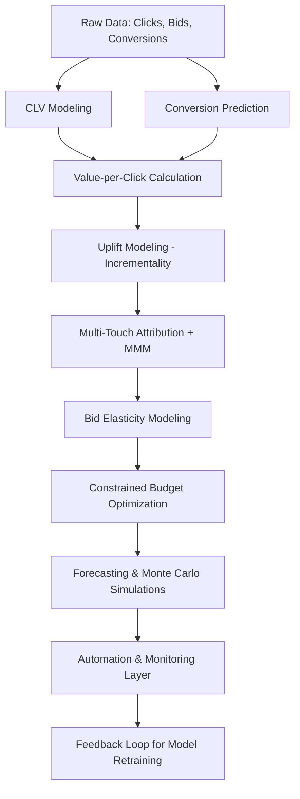

## 5. Optimization, CLV & Budget Allocation


0. The Story
1. [Customer Lifetime Value (CLV)](#51-customer-lifetime-value-clv)
2. [Bidding Strategy Optimization](#52-bidding-strategy-optimization)
   - [Causal Uplift as a Bid Signal](#521-causal-uplift-as-a-bid-signal)
   - [CLV-Adjusted ROAS Targeting](#522-clv-adjusted-roas-targeting)
3. [Budget Allocation Under Constraints](#53-budget-allocation-under-constraints)
   - [CLV-Weighted Spend Allocation](#531-clv-weighted-spend-allocation)
   - [Multi-Objective Optimization](#532-multi-objective-optimization)
4. [Toolkits & Libraries](#54-toolkits--libraries)
5. [Putting It All Together](#55-putting-it-all-together)
   - [Automation & Trigger Logic](#551-automation--trigger-logic)

---

### 0. The Story

## 🧭 The Story of Smart Growth at GetYourGuide – A Data Scientist’s Strategic Playbook

> You’ve just joined the Paid Search team at GYG. You're sitting in a strategy meeting. The goal: grow bookings, but do it smarter — with **less waste**, **more value**, and **repeat customers**. You’re not just a campaign operator now — you’re becoming the architect of a predictive system.

---

### 🌍 Part 1: What Problem Are We Really Solving?

Paid Search at GYG is massive. We spend millions on Google Ads to capture people searching for things like “Eiffel Tower tickets” or “Lisbon walking tour.” That spend powers immediate bookings — but is that the end of the story?

**No.**

Some of those customers:
- Come back for another trip  
- Spend more than average  
- Never convert again  

So the *real* question is:  
> **Who should we spend money to acquire — and how much are they actually worth?**

This isn't just a campaign ops question. It's a **strategy and optimization** problem. You want to:
1. Predict _how much value_ each user is likely to bring over time  
2. Decide _how much you’re willing to pay_ for them  
3. Spend money _where it will grow the business_ — not just hit ROAS this week

---

### 🚀 Part 2: The Strategic Machine We're Building

Let’s build your system — this is your **marketing brain**.

---

#### 🔹 Step 1: Predict Customer Value (CLV)

We start with **Customer Lifetime Value**:
- Some people book a single €20 museum ticket  
- Others book €800 worth of tours over 3 cities  

You train a model that looks at early signals:
- Device, destination, keyword type, time of day, entry funnel, user cohort
- And says: _this person will likely be worth €250 in the next 6 months_

You also **segment users into behavioral cohorts**:
- High-frequency travelers, gift buyers, family planners, last-minute tourists  
- Each segment gets its own CLV profile

Now we’re not bidding blindly — we’re bidding for **value**, and we know which cohorts to prioritize.

---

#### 🔹 Step 2: Predict Whether They’ll Even Convert

You build a **conversion model**. You ask:
> What is the probability this click turns into a booking?

A logistic regression or XGBoost gives you:  
**P(conversion | click context)**

Now you combine both:
   Predicted Value = P(Conversion) × Predicted CLV


You just built **value-per-click**.

---

#### 🔹 Step 3: Add Intelligence – Who’s Actually Persuadable?

Imagine two people:
- One was going to book with or without your ad  
- The other only booked because you showed up on top  

You don’t want to waste bids on the first.

So you add **uplift modeling**:
- Predict the **incremental effect** of the ad
- Prioritize only those where your presence actually **makes a difference**

That’s real **incrementality-aware bidding**.

---

#### 🔹 Step 4: Integrate Attribution + Bid Elasticity

Now you look across the full journey:

- A user clicks a Paid Social ad, then converts via Paid Search. Who gets credit?
- Another user bounces from a generic search term but converts on brand later. Was the first click wasted?

You apply **multi-touch attribution** and **Marketing Mix Modeling (MMM)** to calibrate credit allocation:
- Paid Search gets only **partial credit** when it wasn’t the first touchpoint

You also train a **bid elasticity model**:
- Predict how responsive each keyword or audience is to bid increases
- Combine with value-per-click to spend where marginal return is highest

Now you're optimizing *incremental value per marginal euro*.

---

#### 🔹 Step 5: Budget Optimization Under Constraints

You now have predicted value per user, campaign, and keyword.

But you still have **constraints**:
- €500K monthly budget  
- ROAS target of 2.5  
- Brand visibility goals in top destinations

You turn this into a math problem:
> How do I allocate money across campaigns to maximize expected profit *without breaking constraints*?

You use:
- **Linear programming** (`cvxpy`) or  
- **Risk-aware portfolio optimization** (like mean-variance optimization)  
- Penalize allocations to high-volatility campaigns

This is **constrained optimization with business rules**.

---

#### 🔹 Step 6: Forecast the Future — and Account for Uncertainty

You forecast outcomes of your budget plan:
- How much revenue will this allocation generate?
- What’s the upside/downside?

You use:
- **Prophet**, **ARIMA**, or **Bayesian structural time series**
- **Monte Carlo simulations** to model risk and range of outcomes

Example:  
> “We expect €3.2M revenue next month. 90% of simulations land between €2.8M and €3.6M.”

You're speaking the language of **business planning**, not just performance metrics.

---

#### 🔹 Step 7: Monitoring, Automation, and Learning Loops

The market shifts daily.

- ROAS tanks in Italy?  
  → **Trigger alerts + lower bids**  
- CLV drops in branded search?  
  → **Retrain CLV model**  
- New competitor enters?  
  → **Re-estimate bid elasticity**

You automate:
- Dashboards with anomaly detection  
- Model retraining pipelines (Airflow, Prefect)  
- Scheduled bid adjustments via API or scripts

You also track:
- Model drift (via SHAP/Evidently)  
- Attribution shifts  
- Feedback from post-click behavior (via UX data)

This is no longer a set-it-and-forget-it model — it’s a **living, learning system**.

---

## 🎯 The Strategic Outcome

You no longer say:
> “How did our CPCs perform?”

You now ask:
> “Where are we getting the highest marginal value?”  
> “Are we spending where we drive real, incremental bookings?”  
> “Are we growing long-term value, not just this week’s ROAS?”

You’ve turned Paid Search into a **predictive, causal, risk-aware marketing engine**.

---

## 🔁 Recap: What You’ve Built

| Layer                         | Tool / Method                          | Purpose                                 |
|------------------------------|----------------------------------------|-----------------------------------------|
| Predict CLV                  | `lifetimes`, XGBoost, cohort models    | Long-term customer value                |
| Predict conversion + ROAS   | Logistic regression, XGBoost           | Value per click                         |
| Uplift modeling              | CausalML, EconML                       | Incrementality-aware targeting          |
| Multi-touch Attribution + MMM| Bayesian MMM, Gradient Boost models    | Better credit across channels           |
| Bid Elasticity Modeling      | XGBoost, counterfactual simulation     | Bid sensitivity and marginal return     |
| Budget Optimization          | `cvxpy`, risk-adjusted allocation      | Maximize return under constraints       |
| Forecasting + Risk Analysis  | Prophet, ARIMA, Monte Carlo            | Predict revenue & account for uncertainty|
| Automation & Monitoring      | Airflow, Prefect, SHAP, Dashboards     | Maintain and adapt the system           |

---

## 🧭 System Flow Overview


---

## ✅ Your Role Now

You’re not just reporting on campaign performance — you’re designing the **marketing brain** that:
- Predicts who’s worth acquiring  
- Knows how to bid for them  
- Allocates budget with strategic precision  
- Forecasts growth  
- And adapts in real-time

Welcome to the smart growth engine at GetYourGuide.

---
### let’s sum it all up in a nutshell:

#### Data and Modeling Inputs:

1. CLV Model: Predicts long-term customer value to identify high-value segments.

2. Bid Elasticity Model: Estimates how bid changes affect performance metrics like conversions or clicks.

3. Optimization Layer:

- Combines outputs from the CLV and bid elasticity models.
- Defines an objective (e.g., maximizing conversions while maintaining a target ROAS).
- Solves for the optimal bids that meet the defined goals and constraints.

#### Implementation:
The optimized bids are applied to campaigns, ensuring alignment with strategic goals like growth and high CLV acquisition.

**Tools and Implementation:**

- Likely a mix of custom code and advanced libraries **(like Nevergrad)** for scalable and efficient optimization.
- Continuous feedback loops to refine models and strategies over time.

**In essence, the whole system works together to ensure data-driven, efficient, and growth-focused bidding strategies that align with GetYourGuide’s business objectives.**
---
### 5.1 Customer Lifetime Value (CLV)

Customer Lifetime Value (CLV) is a prediction of the **total value** a customer will bring over their **entire relationship** with the business. It’s essential for optimizing acquisition, bidding, retention, and segmentation strategies.


#### 📊 Types of CLV

| Type                 | Description                                                       | Use Case                                     |
|----------------------|-------------------------------------------------------------------|----------------------------------------------|
| **Historical CLV**   | Sum of past purchases by the customer                             | Simple segmentation, static bidding rules    |
| **Predictive CLV**   | Forecast of future spend based on behavior                        | Dynamic targeting, VBB, budget optimization  |


#### 🔍 Predictive CLV Modeling Approaches

1. **Probabilistic Models (BG/NBD + Gamma-Gamma)**
   - **BG/NBD**: Predicts future **transaction frequency**
   - **Gamma-Gamma**: Predicts **monetary value per transaction**
   - Requires: customer ID, transaction dates, amounts
   - Assumes: non-contractual setting (e.g., eCommerce)

2. **Regression / Machine Learning Models**
   - Inputs: demographics, behavior, recency, frequency, channel
   - Outputs: expected revenue in next X months
   - Models: linear regression, gradient boosting (e.g., XGBoost), neural nets


#### 📦 Required Data

| Data Needed                     | Purpose                                     |
|---------------------------------|---------------------------------------------|
| Customer ID                     | Identify purchase history per user          |
| Transaction dates               | Used to compute recency, frequency          |
| Transaction amounts             | Used to compute monetary value              |
| Optional: channels, segments    | Used to enrich CLV and segment users        |


#### 🧠 Why CLV Matters in Marketing

- **Value-Based Bidding (VBB)**: bid higher for high-CLV users
- **Retention Marketing**: prioritize winback efforts
- **Budget Planning**: allocate more to high-CLV acquisition sources
- **Suppression**: avoid over-spending on low-value segments


### ✅ Summary

- Predictive CLV models provide richer insight than static past value
- Can be estimated using **BG/NBD + Gamma-Gamma** or **ML regressors**
- Enables smarter bidding, segmentation, and retention strategies

---

### 5.2 Bidding Strategy Optimization

Effective bidding means placing the right value on each click or impression. This requires **modeling expected outcomes**, such as conversions or revenue, and **mapping that value** to a bidding strategy aligned with business goals (e.g., ROAS, CPA, LTV).

---

#### 📈 Core Modeling Components

| Component             | Description                                                                 |
|------------------------|-----------------------------------------------------------------------------|
| **Conversion Modeling**| Predicts likelihood that a click converts (e.g., logistic regression, XGBoost) |
| **ROAS Modeling**     | Predicts revenue or profit from a click/user                                 |
| **Bid Elasticity**    | Estimates how cost and volume change with different bid levels               |
| **tROAS Bidding**     | Automated bid targets that aim to maintain a target ROAS                     |

---

#### ⚙️ Conversion & ROAS Modeling

- Use **classification models** to predict `P(conversion | features)`:
  - Logistic regression (interpretable)
  - XGBoost, LightGBM (non-linear)
- Use **regression models** to predict expected **value per click/user**:
  - Input features: user intent, query type, device, time, audience, page, past behavior
  - Output: revenue, AOV, conversion value, CLV

> These models allow translating each impression or click into a **predicted value**, which forms the basis for **value-based bidding** (VBB).

---

#### 📉 Bid Elasticity Modeling

Bid elasticity captures how your **spend, impressions, conversions, or ROAS** change as bids increase or decrease.

- Build this as a **curve or model**:
  - Input: historical bids, impressions, clicks, spend, conversions
  - Output: marginal return at each bid level

You can then:
- Find **diminishing return points**
- Avoid overbidding beyond profitable thresholds
- Simulate **incremental gain vs. cost**

📌 **Use cases**:
- Prevent wasted budget when increasing bids too fast
- Prioritize campaigns with steeper response

---

#### 5.2.1 Causal Uplift as a Bid Signal
- Use uplift models (CATE) to score users/campaigns by incremental value
- Prioritize spend on **persuadable users**
- Replace naive conversion models with **incremental predictors**

#### 5.2.2 CLV-Adjusted ROAS Targeting
- Predict future value of users (CLV) and incorporate it into bidding
- Use CLV as multiplier on ROAS targets
- Aligns ad systems with long-term growth, not short-term conversion value

    **Benefits:**
    - Acquire more valuable users even if they convert at lower short-term ROAS
    - Avoid overpaying for users with low repeat purchase potential

**✅ Summary**

- Bidding is no longer about static CPCs — it's about predicting value and allocating accordingly
- Blend conversion probability, ROAS models, and bid elasticity
- Use causal uplift for incrementality
- Use CLV to correct for short-term revenue bias

### 📊 Bidding Strategy Pipeline: From Prediction to Action

          +------------------+
          |  Raw Data Inputs |
          |------------------|
          | - Click logs     |
          | - Cost data      |
          | - Queries        |
          | - User segments  |
          | - Historical CLV |
          +------------------+
                    |
                    v
          +--------------------------+
          |   Feature Engineering    |
          |--------------------------|
          | - Session context        |
          | - Time features          |
          | - Audience tags          |
          | - Query-type indicators  |
          +--------------------------+
                    |
                    v
     +-------------------------------------+
     |        Predictive Modeling Layer     |
     |-------------------------------------|
     | - Conversion model (logistic/XGB)    |
     | - ROAS model (regression/XGB)        |
     | - CLV model (BG/NBD or ML)           |
     | - Uplift model (CATE)                |
     +-------------------------------------+
                    |
                    v
     +--------------------------------------+
     |   Value Computation / Bid Calculator |
     |--------------------------------------|
     | - Predicted Conversion × Value       |
     | - ROAS-adjusted by CLV               |
     | - Uplift weighting                   |
     | - Bid Elasticity curve applied       |
     +--------------------------------------+
                    |
                    v
     +-----------------------------+
     |   Bidding Strategy Engine   |
     |-----------------------------|
     | - Value-based bidding       |
     | - tROAS optimization        |
     | - Suppress low-incremental |
     +-----------------------------+
                    |
                    v
           Final Bids → Google Ads API

---

### 5.3 Budget Allocation Under Constraints

Marketing budget allocation can be framed as an **optimization problem** where the goal is to **maximize returns** under business constraints like budget, ROAS targets, or campaign caps.

---

#### 🎯 Optimization Framing

| Component         | Role                                                           |
|------------------|----------------------------------------------------------------|
| **Inputs**        | Forecasted ROI, predicted CLV, past performance, max spend     |
| **Constraints**   | Total budget, min tROAS, per-campaign caps                     |
| **Objective**     | Maximize total return (profit, conversions, CLV, etc.)         |
| **Outputs**       | Optimized budget allocation across campaigns or channels       |

This can be solved using **Linear Programming (LP)** or **Quadratic/Convex Optimization**, depending on complexity.

---

#### 🧮 Mathematical Formulation (Simplified)

```
Maximize:     ∑ (ExpectedReturn_i × Allocation_i)

Subject to:
              ∑ Allocation_i ≤ TotalBudget
              ROAS_i ≥ ROAS_min (for all i)
              Allocation_i ≥ 0
```

Where:
- `i` = campaign or channel  
- `ExpectedReturn_i` = predicted revenue or profit  
- `ROAS_i` = return per unit of spend (ROI_i / Spend_i)

This structure can be adapted to:
- Add **risk terms** (variance of return)  
- Limit overspending on low-performing campaigns  
- Impose **minimum spends** (e.g. branding requirements)

---

### 5.3.1 CLV-Weighted Spend Allocation

Short-term ROAS can bias budget allocation toward **low-funnel** or **one-off purchasers**. Instead, use **predicted CLV** to guide spend allocation:

| Campaign             | Short-Term ROAS | Predicted CLV | Adjusted Priority |
|----------------------|------------------|----------------|--------------------|
| Branded Paid Search  | 5.0              | €60            | Medium             |
| Generic Paid Search  | 2.5              | €500           | High               |
| Display Retargeting  | 4.0              | €50            | Medium             |
| Prospecting Display  | 1.2              | €1000          | High               |

📌 Re-rank campaigns not by immediate return, but by **long-term customer value**.

Can be done via:
- Multiplying ROAS × CLV multipliers  
- Replacing ROI input in LP objective with CLV-based value

**Benefits:**
- Avoid underfunding top-of-funnel campaigns  
- Reinforce customer equity-based strategy  
- Spend aligns with **future profitability**, not just today’s

---

### 5.3.2 Multi-Objective Optimization

Real marketing scenarios often involve **conflicting goals**:

| Tradeoff              | Example                                             |
|-----------------------|-----------------------------------------------------|
| Volume vs. Quality    | High-converting but low-LTV users                   |
| Spend vs. ROAS        | Increase spend but stay above 2.0 ROAS             |
| Scale vs. Risk        | Push budget to scale, but not at high variance     |

📌 These can be handled by:
- **Pareto optimization**: maximize multiple objectives simultaneously  
- **Penalty functions**: e.g., penalize low-quality conversions  
- **Constraint layering**: e.g., “maximize conversions, but ≥ 3.0 tROAS, ≤ €50 CPA”

**Tools to use:**
- `cvxpy`: for constrained, multi-objective optimization  
- `scipy.optimize`: for linear/quadratic problems  
- Custom solver loops (e.g. greedy + evaluation) for simpler rule-based allocation

---

### ✅ Summary

- Budget allocation should be **data-driven**, not static  
- Use **expected return**, **CLV**, and **ROAS constraints** as inputs  
- Optimization ensures money flows to high-value, scalable, and strategic campaigns  
- Use **multi-objective methods** to reflect business complexity

---

### 5.4 Toolkits & Libraries
- `lifetimes` for BG/NBD + Gamma-Gamma CLV models
- `scikit-learn`, `xgboost`, `lightgbm` for conversion/ROAS modeling
- `scipy.optimize`, `cvxpy` for spend optimization
- `pandas`, `matplotlib`, `seaborn` for exploration + visualization

---


### 5.5 Putting It All Together

This section ties together the full decision-making pipeline — from **predicting value** to **optimizing spend** — enabling data-driven, scalable marketing.

#### 🔁 Workflow Overview

```
Step 1: Predict Customer Lifetime Value (CLV)
  → Use BG/NBD, Gamma-Gamma, or ML regressors

Step 2: Model Conversion & ROAS
  → Predict likelihood of conversion and expected revenue per user

Step 3: Estimate Incrementality (Optional)
  → Use uplift modeling to find persuadable users/campaigns

Step 4: Optimize Bids
  → Apply value-based bidding, bid elasticity, tROAS thresholds

Step 5: Allocate Budget Under Constraints
  → Use linear programming or multi-objective optimization

Step 6: Forecast Outcomes
  → Predict future revenue, ROI, and risk using Prophet or ARIMA

Step 7: Evaluate & Deploy
  → Visualize, validate, and integrate into live campaign tools
```

This end-to-end system enables **smart targeting**, **efficient spending**, and **long-term value focus**.

---

#### 🌐 Cross-Disciplinary Integration

| Component         | Connected To                       |
|------------------|-------------------------------------|
| CLV Modeling      | Segmentation, Retargeting, LTV bidding |
| ROAS Models       | Forecasting, Bid Strategy           |
| Budget Optimization | Finance, Planning, Portfolio Mix     |
| Forecasting       | Attribution, Seasonality, Budget Planning |
| Causal Uplift     | Incrementality Testing, Bidding Logic  |

---

### 5.5.1 Automation & Trigger Logic

To make your system scalable and responsive, define **automated triggers** that monitor performance and update models or budgets as needed.

---

#### ⚙️ Trigger Events

| Trigger                             | Action Taken                             |
|-------------------------------------|-------------------------------------------|
| **ROAS drops below threshold**      | Re-optimize bids or pause underperformers |
| **CLV drops for top segment**       | Reallocate spend to higher value cohorts  |
| **Elasticity curve flattens**       | Cap bids or shift to other campaigns      |
| **New campaign/product launched**   | Reinitialize models with latest data      |

---

#### 🛠️ Automation Techniques

- **Dashboards with alerts** (e.g., Looker, Tableau)
- **Airflow/Prefect pipelines** for model retraining
- **API integrations** for auto bid updates or platform syncs
- **Jupyter notebooks** for periodic evaluation (weekly/monthly)

---

### ✅ Summary

- This workflow combines CLV, ROAS, attribution, uplift, and budget modeling  
- Output can guide bidding, planning, and measurement decisions  
- **Automation** ensures systems stay responsive and optimized over time

---

                ┌──────────────────────────────┐
                │ 1. Predict CLV               │
                │ (BG/NBD, Gamma-Gamma, ML)    │
                └────────────┬─────────────────┘
                             │
                             ▼
                ┌──────────────────────────────┐
                │ 2. Model Conversion & ROAS   │
                │ (Logistic, XGBoost, Regression)│
                └────────────┬─────────────────┘
                             │
                             ▼
     ┌─────────────────────────────────────────────┐
     │ 3. (Optional) Estimate Uplift / CATE        │
     │ (T-Learner, X-Learner, Causal Forest)       │
     └────────────┬────────────────────────────────┘
                  │
                  ▼
         ┌──────────────────────────────┐
         │ 4. Optimize Bids             │
         │ (tROAS, VBB, Elasticity)     │
         └────────────┬─────────────────┘
                      │
                      ▼
         ┌──────────────────────────────┐
         │ 5. Allocate Budget           │
         │ (LP, cvxpy, constraints)     │
         └────────────┬─────────────────┘
                      │
                      ▼
         ┌──────────────────────────────┐
         │ 6. Forecast Outcomes         │
         │ (Prophet, ARIMA, Monte Carlo)│
         └────────────┬─────────────────┘
                      │
                      ▼
         ┌──────────────────────────────┐
         │ 7. Evaluate & Deploy         │
         │ (Dashboards, APIs, Airflow)  │
         └────────────┬─────────────────┘
                      │
                      ▼
         ┌──────────────────────────────┐
         │ Campaign Execution           │
         │ (Google Ads, Meta, etc.)     │
         └──────────────────────────────┘


